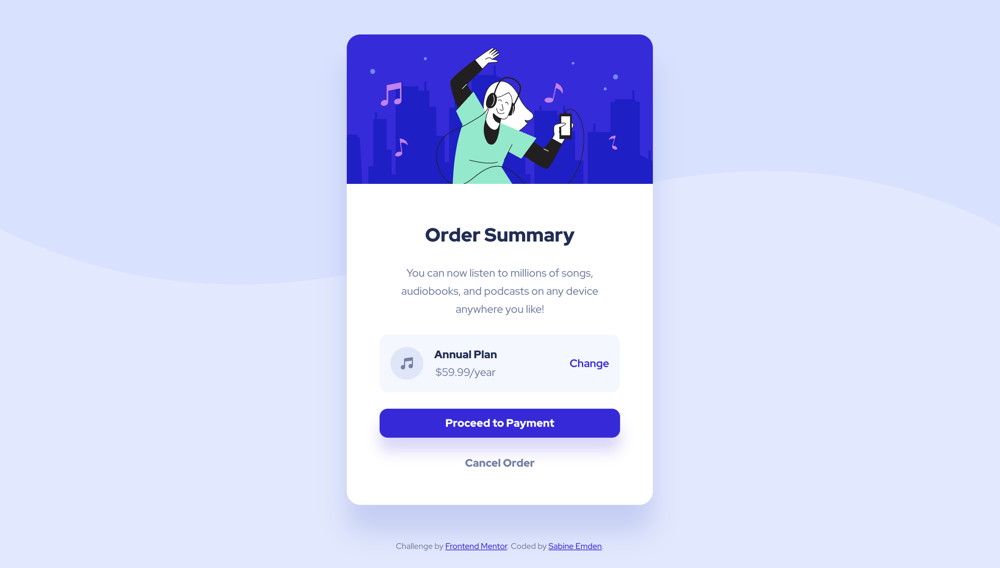

# Frontend Mentor - Order summary card solution

This is a solution to the [Order summary card challenge on Frontend Mentor](https://www.frontendmentor.io/challenges/order-summary-component-QlPmajDUj). Frontend Mentor challenges help me improve my coding skills by building realistic projects.

## Table of contents

- [Overview](#overview)
  - [The challenge](#the-challenge)
  - [Screenshot](#screenshot)
  - [Links](#links)
- [My process](#my-process)
  - [Built with](#built-with)
  - [What I learned](#what-i-learned)
  - [Continued development](#continued-development)
  - [Useful resources](#useful-resources)
- [Author](#author)
- [Acknowledgments](#acknowledgments)

## Overview

### The challenge

The brief for this challenge was to build out the order summary card component and get it looking as close to the design as possible, starting with the following assets:

- Access to Figma design file with mobile, tablet, and desktop layouts
- JPEG design files for mobile and desktop layouts
- Style guide for fonts, colors, etc.
- Optimized image assets
- HTML file with pre-written content

Users should be able to:

- See hover states for interactive elements

### Screenshot



### Links

- Solution URL: [Add solution URL here](https://your-solution-url.com)
- [Live Site](https://sabineemden.github.io/fm-order-summary-component/)

## My process

### Built with

- Semantic HTML5 markup
- CSS custom properties
- Variable web fonts
- Flexbox
- Mobile-first workflow

### What I learned

For this solution, I declared more CSS custom properties (variables) with global scope than I had done in previous projects. I used them not only for colors, but also for font sizes, line-hight, and spacing.

I chose semantic names for the color custom properties, describing the color's function, not its visually appearance:

```css
/* Primary: Blue 100 */
--primary-clr-light: hsl(225 100% 94%);
/* Primary: Blue 700 */
--primary-clr-dark: hsl(245 75% 52%);
```

My goal for this was to make my code more maintainable. Colors or font sizes in the design can be changed by replacing the values of the custom properties without needing to make any other changes to the code.

Chris Coyier warns in his [CSS Custom Properties Guide](https://css-tricks.com/a-complete-guide-to-custom-properties/) for CSS Tricks:

> Custom properties can make code easier to maintain because you can update one value and have it reflected in multiple places. Careful though, overdoing abstraction can make have the opposite effect and make code less understandable.

Using the color names that are used in the Figma design file as custom properties makes the code more readable and my work easier translating the design into code. The added abstraction of using semantic color names makes the code less readable, and I had to refer to the list of property declarations a lot to pick the right color.

For this particular project, I also didn't find any advantage in using custom properties for font sizes, line heights, and spacing. It didn't save me any lines of code, the need to change values for design updates is very hypothetical, and it didn't make writing the CSS code easier.

### Continued development

For future solutions to Frontend Mentor challenges, I will go back to using global CSS custom properties for colors that reflect the color names in the design file and style guide. I will use additional custom properties only if there is a clear benefit to it.

### Useful resources

- [What do you name color variables?](https://css-tricks.com/what-do-you-name-color-variables/) by Chris Coyier for CSS-Tricks - I'm not alone in my struggle with semantic color names. This brief article list a number of different ways to name CSS custom properties for colors, with more tips in the comments.
- [Accessibility of the section element](https://www.scottohara.me/blog/2021/07/16/section.html) by Scott O'Hara - This article convinced me to follow the recommendation of the Frontend Mentor HTML report and use a `<section>` element for the card component.

## Author

I'm an aspiring web developer and a former chemist. What I bring from chemistry to software development is a systematic approach to problem solving and the perseverance to not give up easily.

- Frontend Mentor - [SabineEmden](https://www.frontendmentor.io/profile/SabineEmden)
- Personal Website - [Sabine Emden](https://www.sabineemden.com/)
- Mastodon - [@sabineemden](https://social.tchncs.de/@sabineemden)

## Acknowledgments

This project uses Josh Comeau's [CSS Reset](https://www.joshwcomeau.com/css/custom-css-reset/).

The font family in this project is [Red Hat Display](https://fonts.google.com/specimen/Red+Hat+Display). The fonts are licensed under the [Open Font License](https://openfontlicense.org/open-font-license-official-text/).
